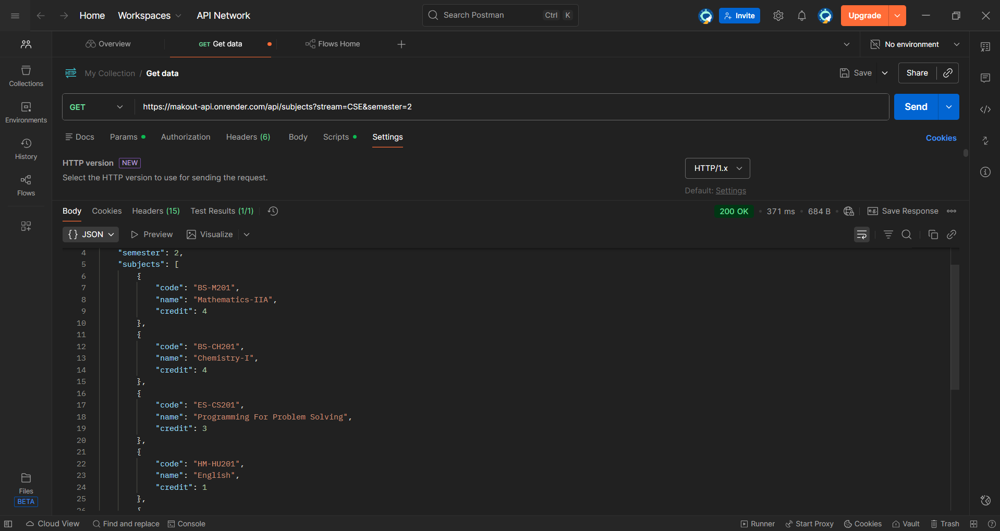

# 📚 MAKAUT Subjects & Credits API

An **unofficial REST API** that provides **semester-wise subjects and credits** for **MAKAUT (Maulana Abul Kalam Azad University of Technology)** undergraduate programs.

This API is designed to be used with academic tools like **CGPA / SGPA calculators**, student dashboards, and educational projects.

---

## 🚀 Live API

Base URL:

```
https://makout-api.onrender.com
```

Example:

```
GET /api/subjects?stream=CSE&semester=1
```

---

## 🧠 Features

* ✅ Stream-wise subject data (CSE, extendable)
* ✅ Semester-wise subjects & credits
* ✅ Regulation support (default: 2020)
* ✅ Clean JSON responses
* ✅ Fast & lightweight (Node + Express)
* ✅ Mobile & frontend friendly
* ✅ Auto-redeploy on GitHub push (Render)

---

## 📌 API Endpoints

### 🔹 Get Subjects by Stream & Semester

**Endpoint**

```
GET /api/subjects
```

**Query Parameters**

| Parameter    | Required | Description                         |
| ------------ | -------- | ----------------------------------- |
| `stream`     | ✅ Yes    | Branch code (e.g. CSE, ECE)         |
| `semester`   | ✅ Yes    | Semester number (1–8)               |
| `regulation` | ❌ No     | Academic regulation (default: 2020) |

---


### ✅ Example Request

```
GET https://makout-api.onrender.com/api/subjects?stream=CSE&semester=1
```

### ✅ Example Response

```json
{
  "stream": "CSE",
  "regulation": "2020",
  "semester": 1,
  "subjects": [
    {
      "code": "BS101",
      "name": "Mathematics I",
      "credit": 4
    },
    {
      "code": "BS102",
      "name": "Physics",
      "credit": 4
    }
  ]
}
```

---

## ❌ Error Responses

### Missing parameters

```json
{
  "error": "stream and semester are required"
}
```

### Invalid stream / semester

```json
{
  "error": "No subjects found for given semester"
}
```

---

## 🗂 Project Structure

```
makaut-api/
├── data/
│   └── cse.json
├── routes/
│   └── subjects.js
├── server.js
├── package.json
└── README.md
```

---

## 🛠 Tech Stack

* **Node.js**
* **Express.js**
* **CORS**
* **JSON-based data store**
* **Render (deployment)**

---

## Structure


## 🧪 Testing the API

### Using Browser

Open:

```
https://makout-api.onrender.com/api/subjects?stream=CSE&semester=1
```

### Using Postman

* Method: `GET`
* URL:

```
https://makout-api.onrender.com/api/subjects?stream=CSE&semester=1
```

---

## 🔧 Local Development

### 1️⃣ Clone the repo

```bash
git clone https://github.com/your-username/makaut-api.git
cd makaut-api
```

### 2️⃣ Install dependencies

```bash
npm install
```

### 3️⃣ Run the server

```bash
npm start
```

Server runs at:

```
http://localhost:3000
```

---

## 🚀 Deployment

The API is deployed using **Render**.

Every push to the `main` branch automatically triggers a redeploy.

---

## ⚠️ Disclaimer

> This is an **unofficial academic API** created for educational and student-use purposes only.
> It is **not affiliated with or endorsed by MAKAUT**.

---

## 🌱 Future Enhancements

* 🔹 Add more streams (ECE, EE, ME, IT)
* 🔹 Add multiple regulations (2018, 2023)
* 🔹 Add electives support
* 🔹 API versioning (`/api/v1`)
* 🔹 Admin panel for managing data

---

## 🤝 Contributions

Contributions, suggestions, and corrections are welcome.
Feel free to open issues or submit pull requests.

---

## ⭐ Acknowledgement

Built to support MAKAUT students with better academic tools.

If you find this useful, consider giving the repo a ⭐ on GitHub.
